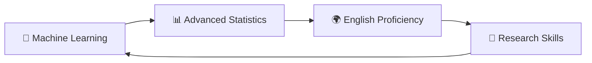

<div align="center">
  
  <!-- Dynamic Typing SVG -->
  
  
  <!-- Profile Views Counter -->
  
  
  <!-- Professional Banner -->
  
  
</div>

---

## 🚀 About Me


```yaml
name: Youssef Fahem
location: Egypt 🇪🇬
education: Computer Science @ Modern Academy, Maadi (2023-2027)
focus: Artificial Intelligence & Machine Learning
status: Building intelligent systems for tomorrow
motto: "Code with purpose, innovate with passion"
```

🎯 **Current Mission:** Transforming ideas into intelligent solutions  
🧠 **Passion:** AI/ML, Deep Learning, Natural Language Processing  
🏆 **Achievements:** Distinctions in Numerical Analysis, Calculus & Linear Algebra  
📚 **Learning:** Advanced Machine Learning, Statistics, English Proficiency  
🔮 **Vision:** Contributing to AI research and building impactful technology  

---

## 🛠️ Tech Arsenal

<div align="center">

### 💻 Programming Languages


### 🎨 Frontend & Mobile


### 🧠 AI/ML & Data Science


### 🛠️ Tools & Platforms


</div>

---

## 📈 GitHub Analytics

<div align="center">
  
  <!-- GitHub Stats -->
  
  
  <!-- Most Used Languages -->
  
  
</div>

<div align="center">
  
  <!-- GitHub Streak -->
  
  
</div>

---

## 🏆 GitHub Achievements

<div align="center">
  
</div>

---

## 🚀 Featured Projects

<div align="center">

### 🤖 AI & Machine Learning
| Project | Description | Tech Stack |
|---------|-------------|------------|
| 🫀 **[Heart Disease Prediction](https://github.com/youseffahem/Heart_Disease_Project)** | Complete ML pipeline for cardiovascular risk assessment | `Python` `Scikit-learn` `Pandas` |
| 🤖 **Study Buddy** | Generative AI chatbot for personalized student assistance | `Python` `AI/ML` `NLP` |
| 🩺 **Medical DefyBot** | React-based intelligent medical education platform | `React` `JavaScript` `AI` |

### 💼 Software Development
| Project | Description | Tech Stack |
|---------|-------------|------------|
| 🏥 **[Hospital Management System](https://github.com/youseffahem/Hospital-Management-System)** | Comprehensive healthcare facility management solution | `Java` `Database` |
| 🚦 **[Traffic Light Simulation](https://github.com/youseffahem/traffic-light)** | Real-time traffic control system simulation | `Programming Logic` |
| 🎢 **[Amusement Park Entrance](https://github.com/youseffahem/amusement-park-entrance-check)** | Automated entrance validation system | `Logic Design` |

### 🧮 Mathematical Computing
| Project | Description | Tech Stack |
|---------|-------------|------------|
| 🧮 **[Jacobi & Gauss Solver](https://github.com/youseffahem/Jacobi-and-Gauss)** | Advanced numerical methods implementation | `Mathematical Algorithms` |
| 🎮 **[Guess the Number](https://github.com/youseffahem/guess-the-number)** | Interactive probability-based game | `Game Logic` |

</div>

---

## 🎓 Education & Training

<div align="center">

| 🏛️ **Institution** | 📚 **Program** | 🗓️ **Duration** | 🏅 **Status** |
|:-------------------:|:---------------:|:----------------:|:--------------:|
| Modern Academy, Maadi | Computer Science | 2023 - 2027 | 🎯 **In Progress** |
| University Program | AI & Machine Learning | 1 Month | ✅ **Completed** |
| Microsoft x Sprints | AI & ML for Beginners | Summer Camp | ✅ **Completed** |

### 🏆 Academic Excellence
- 🥇 **Distinction** in Numerical Analysis
- 🥇 **Distinction** in Calculus  
- 🥇 **Distinction** in Linear Algebra

</div>

---

## 📚 Continuous Learning Journey

<div align="center">

### 🔄 Currently Mastering


### 🎯 Upcoming Goals
- 📈 **Statistics Course** on Coursera
- 🌐 **Advanced English** for global communication
- 🔬 **AI Research** methodologies
- 🏗️ **MLOps** and deployment strategies

</div>

---

## 🎯 Current Focus Areas

<div align="center">

### 🚧 Active Projects
> 🤖 **Study Buddy** - AI-powered educational assistant (Graduation Project - GAIC Program)  
> 🩺 **Medical DefyBot** - Intelligent healthcare chatbot platform  
> 🥁 **Pocket Drum** - Innovative mobile application concept  

### 🔮 Future Aspirations
- 🏢 **Join leading AI research teams**
- 📖 **Publish research papers**
- 🌍 **Contribute to open-source AI projects**
- 🎓 **Pursue advanced degrees in AI/ML**

</div>

---

## 📊 Coding Activity

<div align="center">
  
  <!-- Contribution Graph -->
  
  
</div>

---

## 🤝 Let's Connect & Collaborate

<div align="center">

[](https://www.linkedin.com/in/yousef-fahem0)
[](mailto:yousef.fahem11@gmail.com)
[](https://github.com/youseffahem)

</div>

---

<div align="center">
  
  ### 💭 "In a world of algorithms, be the intelligence that guides them"
  
  <!-- Footer Wave -->
  
  
  ⭐ **Star my repositories if you find them useful!** ⭐  
  🤝 **Always open to collaboration and learning opportunities** 🤝
  
</div>
