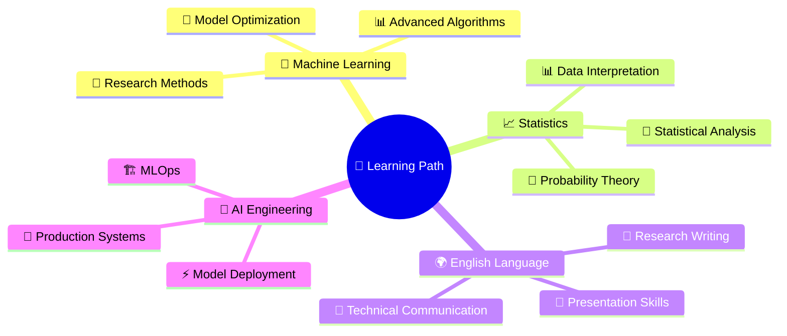

<!-- ============================================================================ -->
<!--                           YOUSSEF FAHEM - AI ENGINEER                        -->
<!-- ============================================================================ -->

<div align="center">

<!-- Animated Header Banner -->


<!-- Dynamic Typing Animation -->
<a href="https://git.io/typing-svg">
  
</a>

<!-- Profile Analytics -->
<p>
  
  
  
  
</p>

</div>

<!-- ============================================================================ -->
<!--                                  ABOUT ME                                    -->
<!-- ============================================================================ -->

##  About Me


```yaml
🧑‍💻 name: "Youssef Fahem"
🎓 education: "Computer Science @ Modern Academy, Maadi"
📅 academic_period: "2023 – 2027"
🌍 location: "Egypt"
🎯 specialization: "Artificial Intelligence & Machine Learning"
🚀 current_role: "Aspiring AI Engineer"
💡 passion: ["Deep Learning", "NLP", "Intelligent Systems"]
🏆 distinctions: ["Numerical Analysis", "Calculus", "Linear Algebra"]
```

<details>
<summary><b>🌟 My Journey & Vision</b></summary>
<br>

> **"Every algorithm I write, every model I train, brings us one step closer to a future where AI enhances human potential."**

🔬 **Research Interests:** Developing intelligent systems that can understand, learn, and adapt  
🌟 **Mission:** Bridge the gap between theoretical AI concepts and practical applications  
🎯 **Goal:** Contribute meaningful innovations to the AI/ML research community  
📈 **Learning Philosophy:** Continuous growth through hands-on projects and academic excellence  

</details>

---

<!-- ============================================================================ -->
<!--                               TECH STACK                                     -->
<!-- ============================================================================ -->

##  Tech Arsenal

<div align="center">

### 🧠 **AI/ML & Data Science**
<p>
  
  
  
  
  
  
</p>

### 💻 **Programming Languages**
<p>
  
  
  
  
</p>

### 🎨 **Frontend & Mobile Development**
<p>
  
  
  
  
</p>

### 🛠️ **Tools & Platforms**
<p>
  
  
  
  
</p>

</div>

---

<!-- ============================================================================ -->
<!--                              GITHUB STATS                                    -->
<!-- ============================================================================ -->

##  GitHub Analytics

<br/>

<div align="center">
  
  
</div>

<div align="center">
  
</div>

---

<!-- GitHub Activity Graph -->
<div align="center">
  
</div>

---

<!-- ============================================================================ -->
<!--                             GITHUB TROPHIES                                  -->
<!-- ============================================================================ -->

##  GitHub Achievements

<div align="center">
  
</div>

---

<!-- ============================================================================ -->
<!--                              FEATURED PROJECTS                               -->
<!-- ============================================================================ -->

##  Featured Projects

<div align="center">

### 🤖 **Artificial Intelligence & Machine Learning**

<table>
<tr>
<td width="50%">

#### 🫀 [Heart Disease Prediction - Full ML Pipeline](https://github.com/youseffahem/Heart_Disease_Project)
**Complete machine learning pipeline for cardiovascular risk assessment**
- 📊 **Data Science** | **Predictive Modeling**
- 🛠️ `Python` `Scikit-learn` `Pandas` `NumPy`
- 🎯 **Features:** Data preprocessing, model training, evaluation metrics

</td>
<td width="50%">

#### 🤖 **Study Buddy** (Graduation Project - GAIC)
**Generative AI chatbot for personalized student assistance**
- 🧠 **Natural Language Processing** | **AI Chatbot**
- 🛠️ `Python` `AI/ML` `NLP` `Deep Learning`
- 🎯 **Features:** Intelligent tutoring, personalized learning paths

</td>
</tr>
<tr>
<td width="50%">

#### 🩺 **Medical DefyBot**
**React-based intelligent medical education platform**
- 🏥 **Healthcare Technology** | **Educational AI**
- 🛠️ `React` `JavaScript` `AI Integration`
- 🎯 **Features:** Medical Q&A, health education, interactive learning

</td>
<td width="50%">

#### 🥁 **Pocket Drum** (In Development)
**Innovative mobile drumming application**
- 🎵 **Mobile Development** | **Audio Processing**
- 🛠️ `Flutter` `Dart` `Audio Engineering`
- 🎯 **Features:** Virtual drumkit, rhythm patterns, music creation

</td>
</tr>
</table>

### 💼 **Software Engineering & Systems**

<table>
<tr>
<td width="50%">

#### 🏥 [Hospital Management System](https://github.com/youseffahem/Hospital-Management-System)
**Comprehensive healthcare facility management solution**
- 🏗️ **System Architecture** | **Database Design**
- 🛠️ `Java` `Database Management` `OOP`
- 🎯 **Features:** Patient records, appointment scheduling, staff management

</td>
<td width="50%">

#### 🚦 [Traffic Light Simulation](https://github.com/youseffahem/traffic-light)
**Real-time traffic control system simulation**
- 🎮 **Simulation Engineering** | **Logic Design**
- 🛠️ `Programming Logic` `State Management`
- 🎯 **Features:** Traffic flow optimization, timing algorithms

</td>
</tr>
<tr>
<td width="50%">

#### 🎢 [Amusement Park Entrance Check](https://github.com/youseffahem/amusement-park-entrance-check)
**Automated entrance validation and safety system**
- 🎪 **Safety Systems** | **Validation Logic**
- 🛠️ `Logic Design` `Conditional Programming`
- 🎯 **Features:** Age verification, safety checks, queue management

</td>
<td width="50%">

#### 🎮 [Guess the Number Game](https://github.com/youseffahem/guess-the-number)
**Interactive probability-based guessing game**
- 🎯 **Game Development** | **Algorithm Design**
- 🛠️ `Game Logic` `Random Algorithms` `User Interface`
- 🎯 **Features:** Smart hints, difficulty levels, score tracking

</td>
</tr>
</table>

### 🧮 **Mathematical Computing & Algorithms**

<div align="center">

#### 🧮 [Jacobi and Gauss Solver](https://github.com/youseffahem/Jacobi-and-Gauss)
**Advanced numerical methods for solving linear equation systems**
- 📐 **Numerical Analysis** | **Mathematical Computing**
- 🛠️ `Mathematical Algorithms` `Computational Mathematics` `Optimization`
- 🎯 **Features:** Iterative solvers, convergence analysis, error estimation

</div>

</div>

---

<!-- ============================================================================ -->
<!--                              EDUCATION & TRAINING                            -->
<!-- ============================================================================ -->

##  Education & Professional Training

<div align="center">

### 🎓 **Academic Excellence**

| 🏛️ **Institution** | 📚 **Program** | 📅 **Period** | 🏅 **Status** |
|:---:|:---:|:---:|:---:|
| **Modern Academy, Maadi** | Computer Science (Bachelor's) | 2023 – 2027 | 🎯 **In Progress** |
| **University Program** | AI & Machine Learning Intensive | 1 Month | ✅ **Completed** |
| **Microsoft x Sprints** | AI & ML for Beginners (Summer Camp) | Summer Program | ✅ **Completed** |

### 🏆 **Academic Distinctions**
<p>
  
  
  
</p>

</div>

---

<!-- ============================================================================ -->
<!--                           CONTINUOUS LEARNING                                -->
<!-- ============================================================================ -->

##  Continuous Learning Journey

<div align="center">

### 📚 **Currently Mastering**



<details>
<summary><b>📅 Learning Roadmap</b></summary>
<br>

| 🎯 **Focus Area** | 📖 **Resource** | ⏰ **Timeline** | 🎉 **Goal** |
|:---:|:---:|:---:|:---:|
| **Statistics** | Coursera Specialization | Next 3 Months | Master statistical foundations for ML |
| **English Proficiency** | Comprehensive Course | Ongoing | Global communication & research |
| **Advanced ML** | Self-Study + Projects | Continuous | Research-level expertise |
| **Research Skills** | Academic Papers + Practice | Ongoing | Contribute to AI research |

</details>

</div>

---

<!-- ============================================================================ -->
<!--                              CURRENT PROJECTS                                -->
<!-- ============================================================================ -->

##  Current Focus & Projects

<div align="center">

### 🚧 **Active Development**

<table>
<tr>
<td align="center" width="33%">
  <br/>
  <b>Generative AI Chatbot</b><br/>
  <i>Graduation Project (GAIC Program)</i><br/>
  🛠️ AI/ML | NLP | Educational Technology
</td>
<td align="center" width="33%">
  <br/>
  <b>Healthcare AI Platform</b><br/>
  <i>Medical Education & Q&A System</i><br/>
  🛠️ React | JavaScript | AI Integration
</td>
<td align="center" width="33%">
  <br/>
  <b>Mobile Drumming App</b><br/>
  <i>Graduation Project Concept</i><br/>
  🛠️ Flutter | Audio Processing | Mobile Dev
</td>
</tr>
</table>

### 🎯 **Future Aspirations**
<p>
  
  
  
  
</p>

</div>

---

<!-- ============================================================================ -->
<!--                              GITHUB STATISTICS                               -->
<!-- ============================================================================ -->

##  GitHub Statistics

<div align="center">


<br/>

<!-- 3D Contribution Calendar -->


<br/><br/>

<!-- Snake Contribution Graph -->
<picture>
  <source media="(prefers-color-scheme: dark)" srcset="https://raw.githubusercontent.com/youseffahem/youseffahem/output/github-contribution-grid-snake-dark.svg">
  <source media="(prefers-color-scheme: light)" srcset="https://raw.githubusercontent.com/youseffahem/youseffahem/output/github-contribution-grid-snake.svg">
  
</picture>

</div>

---

<!-- ============================================================================ -->
<!--                            CONNECT & COLLABORATE                             -->
<!-- ============================================================================ -->

##  Let's Connect & Build Together

<div align="center">

### 🌐 **Professional Networks**
<p>
  <a href="https://www.linkedin.com/in/yousef-fahem0" target="_blank">
    
  </a>
  <a href="mailto:yousef.fahem11@gmail.com" target="_blank">
    
  </a>
  <a href="https://github.com/youseffahem" target="_blank">
    
  </a>
</p>

### 🤝 **Open for Collaboration**
<p>
  
  
  
  
</p>

</div>

---

<!-- ============================================================================ -->
<!--                                 INSPIRATION                                   -->
<!-- ============================================================================ -->

<div align="center">

### 💭 **Philosophy**


---

<!-- Activity Status -->


---

<!-- Footer Banner -->


<!-- Call to Action -->
### ⭐ **Like what you see? Star my repositories and let's build the future together!** ⭐

</div>

<!-- Hidden ASCII Art for Developers -->
<!--
    ____  ____  ____  ____  ____  ____    ____  ____  ____  ____  ____ 
   ||Y ||||o ||||u ||||s ||||s ||||e ||||f ||||f ||||  ||||F ||||a ||||h ||||e ||||m ||
   ||__||||__||||__||||__||||__||||__||||__||||__||||__||||__||||__||||__||||__||||__||
   |/__\||/__\||/__\||/__\||/__\||/__\||/__\||/__\||/__\||/__\||/__\||/__\||/__\||/__\|
   
   🤖 AI Engineer in the Making | 🚀 Code • Learn • Innovate • Repeat
-->

---

<div align="center">
  <i>"Every line of code is a step towards building intelligent systems that make a difference."</i>
</div>
