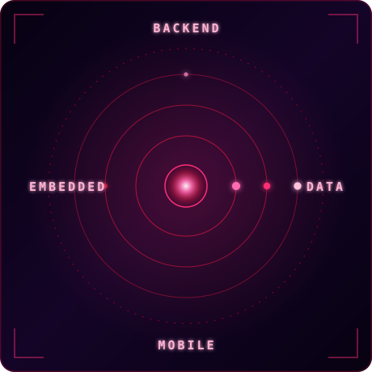

  

  

  
  
  
  
   
  
  

<table>
<tr>
<td width="60%" valign="top">

I build software across the full depth of the stack &mdash; from normalized relational schemas and server-rendered web applications, through supervised machine learning pipelines, down to firmware running on 8-bit microcontrollers.

My most substantial project is <b>RealEstate</b>, a Flask and MySQL property management platform where correctness is pushed down to the database layer: foreign-key delete rules, <code>CHECK</code> constraints and <code>ENUM</code> domains, backed by a <b>274-test suite</b> that asserts the schema itself by reading <code>information_schema</code> and attempting real constraint violations.

Alongside that I work in applied machine learning &mdash; comparative model evaluation, feature selection and resampling on clinical and image datasets &mdash; and in embedded C/C++, building PWM control, analog sensor automation and state-machine-driven interactive systems on Arduino.

<table>
<tr><td><b>Backend</b></td><td>Relational schema design, data integrity, server-rendered apps, JSON APIs</td></tr>
<tr><td><b>Machine Learning</b></td><td>Feature selection, resampling, hyperparameter search, model comparison</td></tr>
<tr><td><b>Computer Vision</b></td><td>Real-time landmark tracking and gesture-driven interaction</td></tr>
<tr><td><b>Mobile</b></td><td>Cross-platform Flutter applications with local and cloud persistence</td></tr>
<tr><td><b>Embedded</b></td><td>GPIO, PWM, UART, analog sensing, state machines</td></tr>
<tr><td><b>Testing</b></td><td>pytest suites covering API, validation, schema and analytics layers</td></tr>
</table>

</td>
<td width="40%" valign="middle" align="center">

</td>
</tr>
</table>

<h4>Backend and Data</h4>

 

<h4>Machine Learning and Data Science</h4>

 

<h4>Computer Vision</h4>

 

<h4>Mobile</h4>

 

<h4>Embedded Systems</h4>

 

<h4>Frontend</h4>

 

<h4>Testing, Tooling and DevOps</h4>

 

<table>
<tr>
<td width="66%" valign="top">

A server-rendered property management platform that centralizes listings, agent assignments and customer inquiries in one normalized relational database. Consistency is enforced at the database layer through foreign keys, cascade rules and constraints rather than by convention.

<ul>
<li><b>Six normalized InnoDB tables</b> with <code>RESTRICT</code>, <code>SET NULL</code> and <code>CASCADE</code> delete behaviour, <code>CHECK</code> constraints, <code>ENUM</code> domains and <code>DECIMAL(14,2)</code> pricing</li>
<li><b>Thin-controller architecture</b> &mdash; routes delegate to paired <code>*_validation</code> and <code>*_queries</code> modules, so validation is testable without a database</li>
<li><b>Live analytics dashboard</b> computing twelve KPIs and five charts from aggregate SQL, drawn with CSS <code>conic-gradient</code> and no charting library</li>
<li><b>Image galleries</b> of up to twelve ordered images per property, uploads validated by extension and stored under UUID filenames</li>
<li><b>Lead pipeline</b> with a controlled <code>New</code> to <code>Contacted</code> to <code>Closed</code> status progression</li>
<li><b>274 passing tests</b> across API, validation, analytics and schema, including DDL introspection that attempts real constraint violations against MySQL</li>
<li><b>Documented security model</b> &mdash; <code>%s</code> parameter binding throughout, Jinja2 autoescaping with no <code>safe</code> or <code>Markup</code> calls, POST-only deletes, and blocked <code>javascript:</code> and <code>data:</code> URLs</li>
<li><b>Accessibility</b> &mdash; skip link, semantic landmarks, keyboard-operable gallery and full <code>prefers-reduced-motion</code> support</li>
</ul>

</td>
<td width="34%" valign="top">

 
 
 
 
 
  

</td>
</tr>
</table>

<table>
<tr>
<td width="66%" valign="top">

An end-to-end machine learning system for cardiovascular risk assessment, built on the UCI Heart Disease dataset and delivered through an interactive web interface.

<ul>
<li><b>303 patient records, 13 clinical features</b>, binary classification across roughly 54 percent positive and 46 percent negative cases</li>
<li><b>Four models compared</b> &mdash; Random Forest, XGBoost, SVM and Logistic Regression, evaluated on accuracy, F1, ROC-AUC, precision and recall</li>
<li><b>Random Forest leads</b> at 85.2 percent accuracy, 0.847 F1 and 0.901 ROC-AUC as documented in the project</li>
<li><b>Feature selection</b> through recursive feature elimination and statistical testing, followed by PCA for dimensionality reduction</li>
<li><b>Grid and randomized hyperparameter search</b> with stratified cross-validation and SMOTE oversampling</li>
<li><b>Top predictive features</b> identified as chest pain type, maximum heart rate, ST depression, major vessel count and thalassemia type</li>
<li><b>Streamlit deployment</b> with Plotly visualisations, containerized with Docker and wired to GitHub Actions</li>
</ul>

</td>
<td width="34%" valign="top">

 
 
 
 
 
  

</td>
</tr>
</table>

<table>
<tr>
<td width="66%" valign="top">

A cross-platform fitness tracking application built with Flutter, covering workout planning, exercise discovery and progress analytics in a single app.

<ul>
<li><b>Screen-based architecture</b> across seven main screens &mdash; login, home, exercises, workouts, profile and detail views</li>
<li><b>Provider state management</b> with <b>Hive</b> for local persistence and <b>Cloud Firestore</b> for sync</li>
<li><b>Firebase Auth</b> supporting multi-factor, biometric and social sign-in</li>
<li><b>Exercise library</b> filterable by muscle group and difficulty</li>
<li><b>Workout management</b> with pre-built programs, custom routines and progressive overload tracking</li>
<li><b>Analytics</b> covering performance metrics, visual progress charts and body measurement tracking</li>
<li>Targets Flutter 3.10+ and Dart 3.0+, tested with Flutter Test, released under the MIT licence</li>
</ul>

</td>
<td width="34%" valign="top">

 
 
 
 
 
  

</td>
</tr>
</table>

<table>
<tr>
<td width="66%" valign="top">

Five embedded systems projects on the Arduino platform, progressing from basic digital I/O through PWM signal control to state-machine game logic and closed-loop sensor automation. Each project ships with its own source, circuit diagram, demo and README.

<table>
<tr><td><b>Controlled LED</b></td><td>Digital input and output, GPIO control with <code>pinMode</code>, <code>digitalRead</code> and <code>digitalWrite</code></td></tr>
<tr><td><b>Disco Strobe Light</b></td><td>Array-based LED sequencing with microsecond timing via <code>delayMicroseconds</code></td></tr>
<tr><td><b>Light Dimmer</b></td><td>PWM brightness control through <code>analogWrite</code>, mapping a 10k potentiometer to real-time PWM output</td></tr>
<tr><td><b>Memory Game</b></td><td>State machine design, random sequence generation, button debouncing and buzzer feedback</td></tr>
<tr><td><b>Plant Monitor</b></td><td>Analog soil moisture sensing with threshold alerting and serial data logging</td></tr>
</table>

</td>
<td width="34%" valign="top">

 
 
 
 
 
  

</td>
</tr>
</table>

  
  <h3>Further Work</h3>

<table>
<tr>
<td width="33%" valign="top" align="center">

<h4><a href="https://github.com/youseffahem/hand-gesture-volume-control">Hand Gesture Volume Control</a></h4>

Real-time hands-free volume control. MediaPipe tracks 21 hand landmarks, the Euclidean distance between thumb tip and index tip is linearly interpolated to a 0&ndash;100 percent level, and PyCAW drives the Windows Core Audio API. On-screen volume bar and live FPS readout.

</td>
<td width="33%" valign="top" align="center">

<h4><a href="https://github.com/youseffahem/Digits-Classifier-Comparison">Digits Classifier Comparison</a></h4>

A controlled comparison of SVM against a Decision Tree on the scikit-learn digits set &mdash; 1,797 samples of 8&times;8 grayscale images, 70/30 stratified split. SVM reaches 98.89 percent accuracy against the Decision Tree's 85.28 percent, with confusion matrices and comparison plots committed.

</td>
<td width="33%" valign="top" align="center">

<h4><a href="https://github.com/youseffahem/Hospital-Management-System">Hospital Management System</a></h4>

A C++ console application modelling hospital branches, doctors and patients as singly linked lists, with insertion, traversal, search and delete-by-id across each entity. Class-based separation per entity type. Written as a data structures exercise, with its own limitations documented.

</td>
</tr>
</table>

  

  

<table>
<tr>
<th align="left">Institution</th><th align="left">Program</th><th align="left">Period</th>
</tr>

<tr>
<td>Modern Academy, Maadi</td><td>B.Sc. Computer Science</td><td>2023 &ndash; 2027</td>
</tr>

<tr>
<td>Microsoft and Sprints</td><td>AI and Machine Learning Summer Camp &mdash; <a href="https://sprints.ai/en-eg/journeys/learning/ID%20-%20SPR%20-%20I92F5Y/view-certificate-serial">certificate</a></td><td>2024</td>
</tr>

<tr>
<td>Ex-Fresher</td><td>Python Programming &mdash; <a href="https://drive.google.com/file/d/1iwOjD47GwBEmMF3y_Fk5r1kqdF14VJzQ/view">certificate</a></td><td>6 months</td>
</tr>

<tr>
<td>IT-GATE</td><td>AI and Machine Learning</td><td>2025</td>
</tr>

<tr>
<td>Ray Group</td><td>Full-Stack Development with Python</td><td>2026</td>
</tr>

</table>

